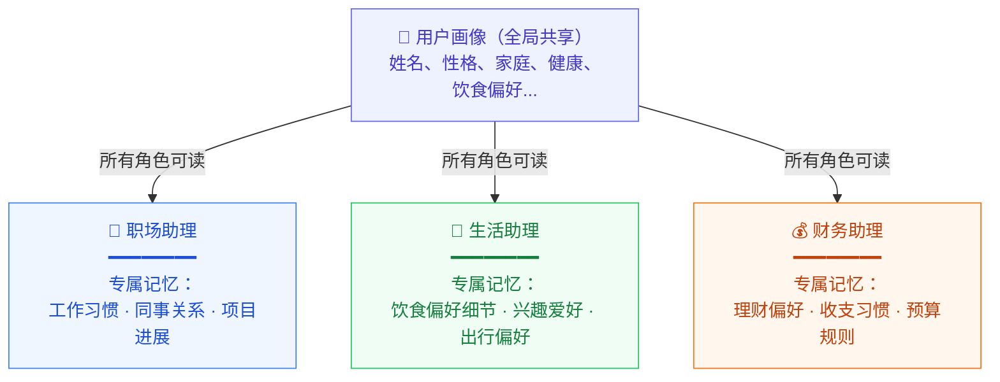
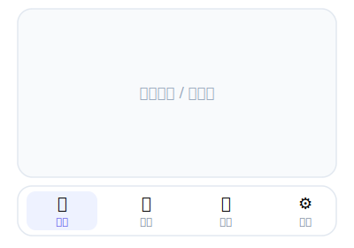
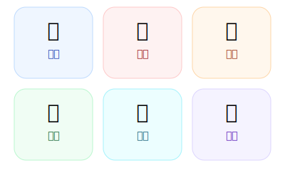
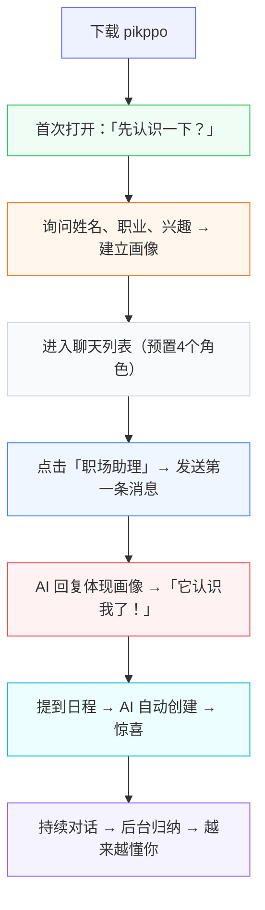
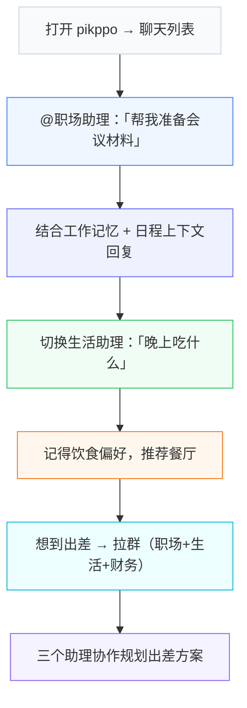

# pikppo 产品设计方案

## 一、产品定位

pikppo 是一个以**对话为核心交互**的私人 AI 助理。用户通过聊天完成所有任务——不需要学习复杂界面，不需要在多个 app 之间切换。

**一句话**：打开 pikppo，跟你的助理说一句话，事情就办了。

---

## 二、核心场景

### 场景 1：多模型自由切换

用户可能同时使用 Ollama 本地模型处理隐私数据，用云端 Claude 处理复杂推理任务。pikppo 支持多模型接入，切换模型时**对话上下文和个人记忆不丢失**——模型只是推理引擎，记忆属于用户。

**典型场景**：
- 用本地 Qwen 处理日常问答（数据不出本地）
- 切换到 Claude 处理复杂的工作汇报撰写
- 再切回本地模型继续闲聊，助理仍然记得你刚才的偏好

**支持的模型服务**：
- 本地：Ollama
- 云端：Anthropic Claude、OpenAI ChatGPT、Google Gemini、DeepSeek、阿里通义千问

加新 provider 的边际成本是 catalog 加一行 + service 加一个子类，UI 与设置自动适配。

### 场景 2：多角色协作

一个助理不可能精通所有领域。pikppo 的多角色设计让每个角色拥有**独立的 Prompt 和专属记忆**，能力更聚焦，回复更精准。

**典型场景**：
- @职场助理：「帮我起草给张总的邮件，说明 Q3 预算方案」—— 它知道你和张总的关系、项目背景
- @生活助理：「推荐附近的餐厅」—— 它记得你不吃香菜、偏好粤菜
- @健康助理：「最近总失眠怎么办」—— 它了解你的血压情况、运动习惯

**角色特性**：
- 每个角色有独立的 system prompt，定义专注领域和回复风格
- 支持自定义角色：填写画像信息，AI 自动生成 Prompt

**记忆与角色的关系**：

用户的完整画像由多个角色共同构建。记忆分为两层：

- **用户画像（全局共享）**：由所有角色的对话中归纳汇总而成，描述用户的整体特征——姓名、性格、家庭、健康状况等。所有角色都能读取，定期学习更新
- **角色专属记忆（按需加载）**：每个角色在自己领域内积累的细节记忆。工作习惯归职场助理、理财偏好归财务助理、兴趣爱好归生活助理。对话时只加载当前角色的专属记忆，避免无关信息干扰



### 场景 3：多角色群聊

遇到跨领域问题，可以把多个角色拉进同一个群聊，各抒己见：

**典型场景**：
- 用户：「下个月要出差上海三天，帮我规划一下」
- 职场助理：「我查了你的日程，周二下午和周三上午有两场会，建议这样安排……」
- 生活助理：「上海这个季节推荐带件薄外套，你上次说想试试本帮菜……」
- 财务助理：「出差标准每天 800 元，三天预算约 2400 元，记得保留发票……」

**群聊特性**：
- 支持 @mention 指定角色回复
- 无 @mention 时，由**路由模型**根据消息内容判断与哪些角色相关，只触发相关角色响应（例如「晚上吃什么」只触发生活助理，「出差规划」触发职场+生活+财务）
- 路由判断为空时，由群组第一个角色兜底回复，确保用户不会得不到响应
- 每个角色基于自身能力独立思考，不重复其他角色说过的内容

### 场景 4：应用市场（工具能力扩展）

聊天能回答问题，但真正有价值的是**帮你做事**。pikppo 的工具能力来自两条路径：

- **内置本地工具（LocalTool）**：用户自管的结构化数据（日历、待办、记忆等）走端上 Repository，零延迟、离线可用、数据不出设备
- **外部服务网关（MCP）**：需要第三方 API Key 或 OAuth 凭据的外部能力（翻译/搜索/邮件/天气等）走 pikppo-mcp 中转——凭据放服务端比放客户端安全

**典型场景**：
- 用户：「明天下午两点有个会议，帮我加到日历里，提前15分钟提醒」
- 助理调用本地日程工具 → 创建事件 → 设置提醒 → 「已添加，明天13:45会在职场助理私聊里提醒你」

- 用户：「把这段话翻译成英文，发给 John」
- 助理调用翻译工具（MCP）→ 翻译 → 调用邮件工具 → 发送 → 「已翻译并发送」

**应用市场设计**：

| 分类 | 工具 | 路径 | 说明 |
| --- | --- | --- | --- |
| 效率 | 📅 日程管理 | 内置 | 日历 CRUD、提醒、AI 自动提取 |
| 效率 | ✅ 待办清单 | 内置 | 任务管理、优先级 |
| 效率 | 💼 记忆管理 | 内置 | 查看 / 编辑 / 清除长期记忆 |
| 效率 | 📧 邮件 | 端上 IM | 端上 IMAP/Gmail API + OAuth |
| 工具 | 🌐 翻译 | MCP | 多语言翻译 |
| 工具 | 🔍 搜索 | MCP | 联网搜索、信息聚合 |
| 生活 | 🗺️ 地图导航 | MCP | 路线规划、周边推荐 |
| 生活 | ☀️ 天气 | MCP | 天气查询、出行建议 |
| 端上 IM | 💬 飞书 / Slack / Telegram | 端上 IM | OAuth 授权后端上调 API，每日聊天提取、待办抽取 |
| 第三方 | 开放接入 | MCP | 开发者通过 MCP 协议自行接入外部服务 |

**两条路径的边界**：
- **凡是用户自管的结构化数据 → 内置本地工具**：日历、待办、记忆、笔记。隐私优先，离线可用，零知识备份
- **凡是需要第三方凭据的能力 → MCP 或端上 IM**：邮件、IM、搜索、翻译、地图。MCP 适合服务端持凭据（如 OpenAI key），端上 IM 适合用户授权直连（如飞书 OAuth）

**与 app 解耦的价值**：
- 产品本体不随功能增加而膨胀
- 第三方开发者可贡献 MCP Server，形成工具生态
- 端上 IM 集成（飞书、Slack、Gmail 等）由 App 内置 OAuth 客户端，凭据存设备 Keychain，**消息内容只在端上处理，服务端永不见原文**

### 场景 5：记忆——越用越懂你

记忆是 pikppo 最核心的能力，也是最大的差异化。pikppo 不只是「记住你说过的话」，而是**从日常对话中主动学习归纳**，持续沉淀关于你的事实知识。

**自动学习机制**：

助理在每次对话中默默观察和归纳，不需要用户主动告知：

| 用户说的话 | 助理学到的 | 记忆类型 |
| --- | --- | --- |
| 「别推荐香菜的，我受不了那个味」 | 不吃香菜 | 饮食偏好 |
| 「我一般早上6点就起了」 | 早起型，作息规律 | 生活习惯 |
| 「上次那个方案太啰嗦了，直接说结论就行」 | 偏好简洁直接的回复风格 | 沟通偏好 |
| 「我家孩子下个月要中考」 | 有孩子，正在备考中考 | 家庭状况 |
| 「最近血压又高了，医生让我少吃盐」 | 血压偏高，需要低盐饮食 | 健康状况 |
| 「我是做产品经理的，主要负责 B 端」 | 职业：产品经理，方向 B 端 | 职业背景 |
| 「我比较内向，不太喜欢社交场合」 | 性格内向，社交偏好低 | 性格特征 |

**学习归纳的核心原则**：
- **被动观察，不打扰**：从对话中自然提取，不弹窗询问「我可以记住这个吗」
- **冲突更新**：新信息覆盖旧信息（「我开始吃素了」→ 更新饮食偏好）
- **渐进沉淀**：多次提及的信息置信度更高，偶尔一提的暂存观察
- **可溯源**：每条记忆关联产生它的会话 id；用户在本机可追溯「你怎么知道的」。注意：换机恢复后，源对话本身属本地数据集（聊天记录），不在加密备份范围；恢复后的设备只能展示记忆条目本身，不能回看原对话

**学习触发时机**：
- **定期总结**：每天/每周对近期对话进行批量归纳，提炼新的事实记忆，更新用户画像
- **闲时总结**：用户不活跃时（如深夜、长时间未操作）后台执行记忆整理，合并碎片信息、更新冲突记忆
- 不在每轮对话中实时提取，避免影响对话响应速度

**三层记忆结构**：

| 层次 | 内容 | 归属 | 生命周期 | 备份范围 |
| --- | --- | --- | --- | --- |
| 语义记忆 | 稳定事实：性格、偏好、背景… | 用户画像（共享）+ 角色专属 | 长期持有，定期归纳更新 | ✅ 加密备份 |
| 情节记忆 | 具体事件：「和张总讨论了预算」「跑了5公里」 | 归属产生对话的角色 | 中期存储，按角色检索 | ✅ 加密备份 |
| 工作记忆 | 当前对话的实时上下文（会话摘要） | 当前会话 | 会话级 | ❌ 本地，随设备 |

情节记忆归属说明：「上周和张总讨论了 Q3 预算」由职场助理对话中产生，归属职场助理；「昨天跑了5公里」由健康助理对话中产生，归属健康助理。对话时只加载当前角色的情节记忆，与角色专属语义记忆一起按需检索。

**为什么情节记忆也进备份**：情节记忆是核心资产——「和张总讨论了 Q3 预算」是用户与助理共同积累的工作上下文，丢机后用户期待换机能找回；体量小（年级几百到几千条文本，几百 KB 量级），不会撑爆备份。隐私由端到端加密保护，服务端永不见明文。

**语义记忆分类**：

| 类别 | 举例 |
| --- | --- |
| 性格特征 | 内向、决策谨慎、注重细节 |
| 沟通偏好 | 喜欢简洁回复、不要列清单、偏好中文 |
| 饮食偏好 | 不吃香菜、海鲜过敏、最近在减糖 |
| 健康状况 | 血压偏高、每周跑步三次、乳糖不耐受 |
| 职业背景 | 产品经理、负责 B 端、团队 10 人 |
| 家庭状况 | 已婚、一个孩子上初中 |
| 生活习惯 | 早起型、喜欢咖啡、周末爬山 |
| 兴趣爱好 | 科幻小说、摄影、精酿啤酒 |

**存储策略**：
- **本地存储**：默认方案，数据不出设备，隐私最优
- **加密云备份（规划）**：核心资产集（长期记忆 + 日历 + 自定义角色 + 群组 + 设置）端到端加密后上送服务端；丢机后在新设备登录账号即可恢复。**信任模型**：密钥由用户恢复短语派生，服务端只持加密 blob 与 wrapped DEK，理论上无法解密——产品文案严守"端到端加密"，不使用"我们承诺不读取"这类降级措辞
- 切换模型时记忆自动携带——记忆归用户所有，不绑定任何模型
- **同一时刻一台活跃设备**：换机走"新设备登录账号 → 拉云备份 → 旧设备转入只读"流程；不支持两台设备并行编辑同一账号（产品克制，避免分裂）

**记忆如何发挥价值**：
- **注入上下文**：对话时自动加载用户画像 + 当前角色专属记忆，助理回复自然体现对你的了解
- **跨角色归纳**：各角色对话中发现的用户特征定期汇总到用户画像，全角色受益
- **越用越准**：第一天它只知道你的名字，一个月后它了解你的性格、习惯、偏好、家庭、工作全貌
- **用户可控**：所有记忆条目可查看、编辑、删除，不存在「偷偷记住」

---

## 三、产品结构

### 3.1 底部导航（Dock 栏）

保持四个核心 Tab，**聊天是绝对主入口**：




| Tab | 功能 |
| --- | --- |
| **聊天** | 私聊列表 + 群聊列表，点击进入对话。这是用户 90% 时间所在 |
| **角色** | 角色卡片浏览、新建角色、创建群聊 |
| **应用** | 工具入口网格：本地日历（内置 LocalTool）、汇率（走 MCP）等独立子页，后续接入股票/天气/邮件 |
| **设置** | 模型配置、MCP 配置、个人信息、记忆管理 |

### 3.2 聊天（核心）

聊天界面是完成一切任务的入口。用户**只需要会打字**。

**私聊**：选一个角色，直接对话。助理基于角色 Prompt + 个人记忆 + 日程上下文回复。

**群聊**：拉多个角色进群，一个问题多视角回答。

**对话中触发工具**：
- 用户提到日程 → AI 自动提取并创建（端上日历 LocalTool，零延迟）
- 用户说「提前1小时提醒我」→ AI 解析并设置提醒
- 用户说「翻译成英文」→ 调用翻译工具（MCP）
- 所有操作在对话中完成，不需要跳转到其他页面

**提醒以聊天消息 + 系统通知双轨呈现**：
- 创建日程时，端上小模型按事件内容判断归属角色（**一条事件 = 一个角色**），结果记在事件上
- 到点：对应角色在私聊里发一条提醒消息；同时弹出微信式系统通知（锁屏 / 通知中心），点击进入该角色聊天
- 邮件 / IM 集成产生的待办同样在抽取时即决定归属
- 路由与通知调度全部端上完成，事件内容与角色清单不出设备；App 即使被杀，OS 也会按预先注册的调度准时弹出

**消息上下文构建**：
```
system: {角色 Prompt}
        {用户画像：姓名、性格内向、已婚、血压偏高、不吃香菜...}
        {角色专属记忆：工作习惯、同事关系、项目进展...}
        {角色情节记忆：上周和张总讨论了 Q3 预算...}
        {日程上下文：明天 14:00 团队周会、后天出差上海...}
history: 最近 10 条对话
user:    当前输入
```

### 3.3 角色

**预置角色**：

| 角色 | 图标 | 领域 | 风格 |
| --- | --- | --- | --- |
| 职场助理 | 💼 | 邮件、会议、任务、汇报 | 简洁专业 |
| 生活助理 | 🌿 | 餐饮、出行、购物、家庭 | 轻松自然 |
| 财务助理 | 💰 | 收支、预算、账单提醒 | 严谨准确 |
| 健康助理 | ❤️ | 运动、饮食、睡眠 | 有据可依 |

**自定义角色创建**：
1. 填写：名称、emoji、颜色、领域（多选）、风格（单选）、语言、特别说明
2. AI 生成 system prompt（调用本地模型）
3. 用户编辑确认
4. 保存

**群组创建**：从角色列表多选 ≥2 个角色 → 命名 → 创建。

### 3.4 应用

应用页是 MCP 工具的可视化入口，纯粹的工具集合，3 列网格展示：



点击进入对应工具的独立页面（如日历的日期选择 + 事件列表）。

**关键设计**：
- 应用页只放**外部工具**（通过 MCP 接入），不放 app 核心功能（记忆、角色等）
- 应用页是工具的**管理入口**，但大部分工具操作可以在聊天中通过对话完成
- 记忆管理在设置页中，不在应用 dock 里——记忆是 app 内在能力，不是外挂工具

### 3.5 设置

| 配置项 | 说明 |
| --- | --- |
| 模型服务类型 | 本地（Ollama）/ 云端（Claude · ChatGPT · Gemini · DeepSeek · 通义千问） |
| 模型服务地址 | 可自定义 |
| 当前模型 | 从服务动态拉取 |
| API Key | 各家云端 provider 各持一份，存设备 Keychain |
| MCP 服务地址 | 可自定义，默认 localhost:8000 |
| 端上 IM 授权（中期） | 飞书 / Gmail / Slack / Telegram 的 OAuth 入口 |
| 加密备份（规划） | 账号登录、恢复短语生成、备份状态、历史版本 |
| 锁屏显示提醒详情 | 默认 ON；OFF 时锁屏只显示"pikppo · 1 条提醒"，进 App 后再看完整内容 |
| 用户名 | 助理称呼你用 |
| 偏好语言 | 中文 / 英文 |
| 记忆管理 | 查看 / 导出 / 清除 |

---

## 四、关键设计决策

### 4.1 为什么是对话优先

传统 app 用按钮和表单完成任务。pikppo 用对话——因为对话是最低门槛的交互方式，且 AI 能理解意图后自动调用正确的工具。用户不需要知道「日程管理」在哪个菜单里，只需要说「帮我安排一下」。

### 4.2 为什么角色要有独立记忆

如果所有角色共享全部记忆，职场助理就会知道你的健康隐私，生活助理会被工作术语干扰。独立记忆让每个角色**只关注自己需要知道的事**，回复更精准。基础个人特征（姓名、过敏原等）通过共享记忆层解决。

### 4.3 为什么工具通过 MCP 而不是内置

内置功能意味着每加一个能力 app 就要发版。通过 MCP 协议接入：
- app 只做对话和记忆，保持精简
- 工具可以独立开发、独立部署、独立更新
- 第三方可以贡献工具，形成生态
- AI Agent 可以直接调用工具，不受 app UI 限制

### 4.4 为什么记忆不绑定模型

大多数 AI 产品的记忆和模型绑定——换了 ChatGPT 就丢了 Claude 积累的上下文。pikppo 的记忆存在端上 drift（可选端到端加密备份到自家服务端），模型只是「借用」记忆来推理。这是产品最强的护城河：**用得越久，越难替换**。

### 4.5 为什么提醒既是聊天消息又是系统通知

系统通知解决"事件触达"——锁屏、通知中心、横幅，是用户与提醒系统的关系，App 不在前台时唯一能触达用户的途径。聊天消息形态的提醒解决"事件归属"——是"角色与用户的关系"，让职场助理在私聊里告诉你"10 分钟后有周会，要不要我帮你打开会议链接"，比单条横幅更像一个真正的助理。

两者职责互补，pikppo 同时做：
- 系统通知由 App 在事件创建时预先注册到 OS（AlarmManager / UNUserNotificationCenter），App 被杀也能弹出，样式与微信一致（角色名作主标题，提醒文作副标题）
- 聊天消息在前台或用户进 App 后留底，可追问、可撤销、可让助理改时间——成为对话历史的一部分，不是死信
- **一条事件一个角色归属**：由 ReminderRouter 在事件创建时端上判定并 cache；事件不可能同时归两个角色私聊，避免锁屏刷屏与归属语义模糊

### 4.6 为什么提醒只归一个角色而非按域路由到多个

每条事件归属单一角色是产品克制：
- 锁屏可见性：两条系统通知 = 用户被打扰两次，体验劣化
- 归属语义：用户事后追溯"这件事我和谁聊过"应该有单一答案
- 路由失败回退简单：归属不确定时统一退到默认角色（职场助理），用户进 App 还可以改归属

例外是"家庭聚餐谈年终奖"这种真跨域的，归属由路由器判主导项（看哪个词权重高），无歧义。

### 4.7 为什么不接微信公众号 / 不做服务端 bot 代答

赛道选择。pikppo 的护城河是"端到端加密 + 服务端永不持记忆"——做服务端 IM bot 意味着服务端必须 24/7 在场、必须持用户凭据、必须读消息内容，零知识承诺立刻降级为"承诺不读"。这是不可逆的单向门。

替代路径足够：端上 IM 集成（飞书 / Gmail / Slack 等 OAuth 直连）覆盖 80% 入口前移价值；桌面端 + 浏览器插件 + 智能硬件配对覆盖剩下的"我要它无处不在"需求；全部不破坏隐私底线。

---

## 五、用户旅程

### 新用户首次使用



### 日常使用



---

## 六、演进路径

| 阶段 | 聚焦 |
| --- | --- |
| **当前 MVP** | 多角色对话 + 本地模型 + 5 家云端模型 + 记忆系统 + 本地日历 + 提醒（聊天消息 + 系统通知双轨）|
| **下一步** | 账号体系 + 加密云备份（核心资产集端到端加密上送）+ 待办清单（端上）+ 端上飞书集成（OAuth 直连）|
| **中期** | 桌面端（macOS / Windows）+ 浏览器插件 + 更多端上 IM 集成（Gmail / Slack / Telegram）+ 第三方 MCP 工具生态 |
| **远期** | 智能硬件配对（耳机 / 手表）+ 系统级深度集成（iOS Shortcuts / Android 无障碍）+ 端上读屏代答自动化（可选）|

**明确不做**（架构性放弃，与零知识单向门冲突）：
- 微信公众号 / 企业微信代答 bot 等服务端 IM bot
- 24/7 服务端代答（"别人加你微信问'在吗' pikppo 替你回"——技术不可行 + 社交雷）
- 企业版多租户（多用户共享记忆/角色 与个人零知识助理定位冲突）
- 服务端 agent 主动联系用户 / 服务端检索 / 服务端 RAG（全部在端上跑）
