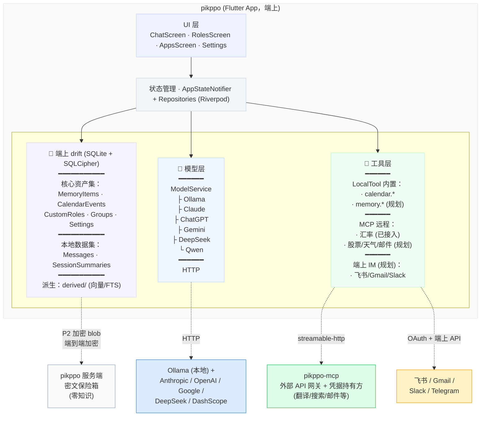

# pikppo 技术方案设计

> **文档范围**：本文只迭代**基础架构、数据存储、记忆规划、agent 路由**及相关接口/模块。
> **应用场景类能力**（用户可感知的功能行为：消息操作、选词解释/翻译、日历、汇率等）
> 见 `应用能力设计.md`，不在本文堆积。

## 一、背景与目标

### 1.1 背景

pikppo 是一个以对话为核心的私人 AI 助理应用。产品的核心差异化在于：**记忆属于用户而非模型**——用户可以自由切换模型（本地 / 五家云端），记忆不丢失；多个角色共建用户画像，同时在各自领域保持专属记忆；外部工具能力通过两条路径接入（端上 LocalTool + 远程 MCP），与 app 核心解耦。

本技术方案与 `data-architecture.md` v3.2 同步：架构从早期"全本地 + 单体存储"演进到"端上 drift 真相源 + 零知识加密云备份 + 端上 IM 集成 + 远程 MCP 网关"的四层模型。Phase 1（本地化）日历部分已落地，记忆层 schema 对齐工作待补；v3.2 引入提醒单角色路由 + 系统通知双轨。

### 1.2 设计目标

1. **隐私优先（零知识）**：核心资产集（长期记忆、日历、自定义角色、群组、设置）端到端加密，服务端无明文业务表、无 LLM 工具、无解密能力
2. **模型无关**：记忆与模型解耦，切换模型零成本；本地（Ollama）与 5 家云端（Claude / ChatGPT / Gemini / DeepSeek / Qwen）无缝并存
3. **能力可扩展**：内置 LocalTool 处理结构化本地数据，MCP 网关处理需第三方凭据的外部能力，两条路径互不耦合
4. **只加不改**：后续每一期演进只挂在脊柱 S1–S5 上，不触碰已落地层（验收不变式见 v3.1 §11）
5. **离线可用**：MCP 不可用不影响内置本地工具与基础对话；零知识云备份失败不阻塞写操作

### 1.3 设计原则

| 原则 | 说明 |
| --- | --- |
| **数据分治** | 核心资产集本地真相源 + 加密备份；本地数据集走端上 + 设备直传；派生数据可重算，不进任何包 |
| **写路径收口** | 各域 Repository 唯一写入口，统一盖戳 + 软删 + 副作用编排；DAO 原始写方法不导出 |
| **接口抽象** | ModelService 屏蔽 LLM 差异（5 家云端 + 本地共一份基类）；McpService 屏蔽 MCP 工具差异；上层无感知 |
| **零知识单向门** | 服务端永不持记忆、永不跑 agent；提醒、路由、检索、IM 内容感知全部端上完成 |
| **调用方无感知** | UI 与 LLM LocalTool 永远只读写本地 drift，不感知备份/同步存在 |

---

## 二、技术决策

### 2.1 为什么用 drift/SQLite 而非 SharedPreferences

| 维度 | SharedPreferences | drift/SQLite + SQLCipher |
| --- | --- | --- |
| 结构化查询 | 不支持 | 原生支持，按 roleId / 时间窗 / kind 过滤 |
| 并发写入 | 单线程序列化 | 后台 isolate + WAL |
| 加密 | 无 | SQLCipher（Android）/ NSFileProtection（iOS） |
| 脊柱 S1（PRAGMA user_version） | 不支持 | 原生 |
| 脊柱 S2（每账号一库文件） | 单一存储区 | 文件系统级隔离 |
| 脊柱 S5（DAO 层墓碑过滤） | 业务层手动过滤易漏 | DAO 层统一拼 `where deleted = false` |
| 快照备份（ATTACH + INSERT SELECT） | 不支持 | 原生 |

**决策**：drift（SQLite + SQLCipher）作为唯一真相源，从 Phase 1 第一天起就位。SharedPreferences 仅保留**KV 类设置**（serviceType / serviceHost / userName / preferredLanguage / onboardingCompleted 等），不再承载任何业务实体。

历史包袱：早期 MVP 用过 SharedPreferences 全量 JSON 形态存 messages/memories/groups/customRoles；已写迁移脚本 `migrateFromPrefsIfNeeded`，首次启动一次性灌进 drift，事后跳过。

### 2.2 为什么 LLM 服务统一抽象

`ModelService` 是个抽象类，子类按厂商协议实现。当前实现：

| 子类 | 厂商 | 协议家族 |
| --- | --- | --- |
| `OllamaService` | Ollama（本地） | Ollama HTTP（按模型能力查 `/api/tags` 判定 tool 支持） |
| `CloudModelService` | Anthropic Claude | Anthropic Messages API |
| `GeminiService` | Google Gemini | Generative Language API |
| `OpenAIService` | OpenAI ChatGPT | OpenAI Chat Completions（推理模型 o1/o3/o4 自动切 `max_completion_tokens`） |
| `DeepSeekService` | DeepSeek | OpenAI 兼容 |
| `QwenService` | 阿里通义千问 | OpenAI 兼容（DashScope `/compatible-mode`） |

OpenAI / DeepSeek / Qwen 共用基类 `OpenAICompatibleService`——三家差异只在 host / fallback 模型列表 / chat-model 命名前缀过滤。加新 OpenAI 兼容 provider 的边际成本 = `cloudProviderCatalog` 加一行 + service 加一个 5 行子类。

**决策**：协议家族级别复用基类；UI 配置数据集中在 `cloud_provider_catalog.dart`（displayName / defaultHost / apiKeyHint / secureStorageKey），新增 provider 不改 UI 代码、不改 state schema。

### 2.3 为什么记忆留本地 + 加密备份（不走 MCP）

| 方案 | 优势 | 劣势 |
| --- | --- | --- |
| 记忆走 MCP | 多设备同步；任何 Agent 可查询 | 服务端持明文记忆，破坏零知识 |
| **记忆留本地 + 端到端加密备份**（v3.1） | 隐私最优；零知识可兑现；离线可用；DEK 由用户恢复短语派生 | 多设备并行编辑不支持（产品克制选择，单设备语义清晰） |

**决策**：记忆永远在端上 drift。Phase 2 上线加密备份时，核心资产集（含 MemoryItems / SessionSummaries 中归用户画像或角色专属的部分）按 v3.1 §6/§7 走 DEK 加密 blob 上送服务端；服务端只存密文，KEK（用户恢复短语派生）永不上传。

### 2.4 提醒：聊天消息 + 系统通知双轨

| 形态 | 触达场景 | 工程性质 |
| --- | --- | --- |
| 系统通知（OS 锁屏/通知中心） | App 不在前台时唯一的触达手段 | App 在事件创建时预先 schedule 到 OS，App 被杀也能弹 |
| **聊天消息**（角色私聊） | App 前台 / 用户进 App 后的留底 | 可追问、可撤销、可改时间，是工作流入口 |

**决策**：两者并行，**一条事件 = 一个角色**——避免锁屏被同一事件刷屏两条，且事件归属语义清晰（用户事后追溯"这件事和谁聊过"是单一答案）。

实现链路（端上）：
```
事件创建/修改（Repository.create / update）
  → ReminderRouter 端上判断（规则 prefilter + LLM 兜底）→ 单一 roleId
  → 写回 CalendarEvents.routedRoleId（v3.2 新增列）
  → NotificationService.scheduleFor(event, roleId)
        本地注册到 OS（iOS UNUserNotificationCenter / Android AlarmManager）
        group key = roleId（同角色多条提醒堆叠，微信式分组）
事件被删 → cancelFor(event.id)
角色被删/重命名 → Repository.rerouteFutureEvents()：批处理未来事件重路由 + reschedule
到点触发：
  · App 前台 → ReminderScheduler 流 → 聊天消息 + 系统通知（前台兜底，防 OS 漏触发）
  · App 后台 / 被杀 → OS 直接弹通知（聊天消息在用户进 App 时按到点 timer 补写）
```

**为什么创建时路由（而非触发时路由）**：OS 调度器在 App 被杀时仍能弹通知，但**无法跑路由代码**。把决策提前到写入时、用持久层 cache（`routedRoleId`），是 OS 通知机制下的工业标准做法（微信/钉钉本质同构）。代价是 CalendarEvents 加一列，但跟 S3-S5 一起进备份，换机后归属保留。

路由失败/超时 → `routedRoleId = null`，触发时退到默认角色（预置职场助理）。

### 2.5 为什么端上 IM 集成（不接服务端 IM bot）

| 类型 | 示例 | 零知识 | 选择 |
| --- | --- | --- | --- |
| 端上集成（OAuth + API 直连） | 飞书 / Gmail / Slack / Telegram | ✅ 兼容 | **做** |
| 服务端 bot | 微信公众号、企业微信代答、Telegram bot 服务端模式 | ❌ 冲突 | **不做** |

**决策**：端上 IM 集成由 App 内置 OAuth 客户端，凭据存设备 Keychain，消息内容仅在端上处理。服务端 IM bot 全部不做——零知识承诺立刻降级为"承诺不读"是不可逆的单向门。

附带：个人微信不开放任何 bot/API，"代答微信"在生态层根本不存在；唯一可行的"代答"路径是 Android 无障碍 / iOS 截屏读屏，与"是否接服务端 IM"无关。

### 2.6 群聊路由：LLM 判断 vs 规则匹配

| 方案 | 优势 | 劣势 |
| --- | --- | --- |
| **LLM 路由** | 理解自然语言意图，准确率高 | 每次群聊多一次 LLM 调用，延迟增加 |
| 关键词规则 | 速度快，无额外开销 | 维护成本高，无法理解复杂意图 |

**决策**：LLM 路由。群聊场景对延迟不如私聊敏感，路由 prompt 短（<100 token）。`@mention` 显式指定时跳过路由，路由判断为空时由群组第一个角色兜底回复。

### 2.7 Riverpod StateNotifier 与 Repository 解耦

当前 `AppStateNotifier` 负责会话/记忆/角色等状态；Calendar / Memory 各自抽出 Repository（v3.1 §4 写路径收口纪律）。Repository 由独立 Provider 提供（`calendarRepositoryProvider`、`reminderSchedulerProvider`），避免与 `appStateProvider.notifier` 循环依赖。

---

## 三、系统架构

### 3.1 整体架构



**关键边界**：
- pikppo 服务端**只是密文保险箱**，不做 agent、不持记忆、不跑 LLM
- pikppo-mcp 是**外部 API 网关 + 凭据持有方**——任何需第三方 API Key 或 OAuth refresh token 的工具必须经此中转，避免客户端泄露凭据
- 端上 IM 集成走 App 内置 OAuth + API 直连，凭据存设备 Keychain，**不经过 pikppo 服务端也不经过 pikppo-mcp**——隐私级别最高

### 3.2 工程结构

| 工程 | 技术 | 职责 |
| --- | --- | --- |
| **pikppo** | Flutter/Dart | 客户端 app：对话、角色、记忆、本地工具、端上 IM 集成、零知识备份客户端 |
| **pikppo-mcp** | Python/FastMCP（streamable-http） | 外部 API 网关：翻译/搜索/邮件等需第三方凭据的工具 |
| **pikppo backend** | 待定（Phase 2） | 密文保险箱：账号、密钥包裹存储、加密 blob 存取 |

### 3.3 数据归属

| 数据 | 存储位置 | 备份范围 | 实现 |
| --- | --- | --- | --- |
| 用户画像（MemoryItems roleId=null） | 端上 drift | ✅ 加密备份 | `memories` 表（待迁 `MemoryItems`） |
| 角色专属语义记忆（MemoryItems roleId≠null） | 端上 drift | ✅ | 同上 |
| 情节记忆（MemoryItems kind=event） | 端上 drift | ✅ | 同上 |
| 会话摘要（SessionSummaries） | 端上 drift | ❌（本地数据集） | 待迁 |
| 聊天消息 | 端上 drift | ❌（本地数据集） | `messages` 表 |
| 自定义角色（CustomRoles） | 端上 drift | ✅ | `custom_roles` 表（待加 S4/S5） |
| 群组（Groups） | 端上 drift | ✅ | `groups` 表（待加 S4/S5） |
| 用户设置 KV | SharedPreferences | ❌（迁移到 drift Settings 表后纳入备份） | 短期保留 |
| 日历事件 | 端上 drift | ✅ | `calendar_events` 表（已落地） |
| 翻译/搜索/邮件等结果 | 不持久化 | — | MCP 调用即用即弃 |

---

## 四、技术栈

### 4.1 客户端 (pikppo)

| 模块 | 技术 | 版本 |
| --- | --- | --- |
| 框架 | Flutter / Dart | SDK ^3.11 |
| 状态管理 | flutter_riverpod | ^2.6.1 |
| 本地存储 | drift + sqlcipher_flutter_libs | drift ^2.21 |
| 安全存储 | flutter_secure_storage | ^9.2 |
| HTTP | dio | ^5.8 |
| MCP 客户端 | mcp_client | ^2.0 |
| 路由 | go_router | ^15.1 |
| UI | Material 3 | Flutter 内置 |
| ID 生成 | uuid | ^4.5 |
| 文件路径 | path_provider / path | ^2.1 / ^1.9 |

### 4.2 MCP 服务 (pikppo-mcp)

| 模块 | 技术 |
| --- | --- |
| 框架 | FastMCP (Python mcp SDK) |
| 传输协议 | streamable-http |
| 默认端口 | 8000 |
| 部署 | 开发期本机；发布到 Cloud Run，Workload Identity 绑 service account（不下载 JSON key） |

---

## 五、数据模型

按 `data-architecture.md` v3.1 §3.3 完整定义。本节仅列与 Flutter 端代码强相关的部分。

### 5.1 Role / Group

```dart
class Role {
  final String id;           // UUID
  final String name;
  final String icon;         // emoji
  final String description;
  final String color;        // hex
  final String systemPrompt;
}
class Group {
  final String id;
  final String name;
  final List<String> roleIds;
}
```

drift schema 见 v3.1 `CustomRoles` / `Groups`（含 S4/S5）。

### 5.2 Message

```dart
class Message {
  final String id;           // UUID
  final String roleId;
  final String content;
  final bool isUser;
  final int timestamp;
  final String? groupId;     // null=私聊
  final String kind;         // 'chat' | 'reminder' | 'tool_status'
}
```

`kind='reminder'` 是端上 ReminderRouter 推入的提醒消息（§2.4）。

### 5.3 Memory（向 v3.1 MemoryItems / SessionSummaries 演进）

```dart
class Memory {
  final String id;
  final String type;         // 'semantic' | 'episodic' | 'working'
  final String content;
  final String? roleId;      // null=用户画像; non-null=角色专属（含情节记忆）
  final int timestamp;
  final List<String> tags;
}
```

**迁移路径**：Phase 1.6 将 `MemoryRows` 拆为 `MemoryItems`（核心资产，备份）+ `SessionSummaries`（本地数据集，不备份）。type 与 v3.1 `kind` 的映射：
- `semantic` → `kind ∈ {identity, preference, relation, fact}`（由 LLM 沉淀器细分）
- `episodic` → `kind = event`（情节记忆，仍归核心资产备份）
- `working` → `SessionSummaries`（短期记忆，不进备份）

### 5.4 CalendarEvent

```dart
class CalendarEvent {
  final String id;
  final String title;
  final String description;
  final DateTime startTime;   // UTC
  final DateTime? endTime;
  final bool allDay;
  final String? recurrenceRule;
  final int? reminderMinutes;
  final String? routedRoleId;  // v3.2 - 创建时由 ReminderRouter 写入
  // 同步元数据
  final DateTime updatedAt;
  final bool deleted;
}
```

UTC 入库，UI 展示由 `localStart` / `localTimeLabel` 等本地化 getter 转换。`routedRoleId` 在 Repository.create/update 时由 ReminderRouter 端上判定并 cache——OS 通知预调度需要在 App 被杀场景下知道归哪个角色，触发时无法跑路由器。

### 5.5 AppState（精简后）

```dart
class AppState {
  final List<Role> roles;
  final List<Message> messages;          // 按会话懒加载，state 中只是某些 scope 的并集
  final List<Memory> memories;
  final List<Group> groups;
  final Map<String, ConversationSummary> conversationSummaries;
  final String currentRoleId;
  final String currentModel;
  final String serviceType;              // 'local' | 'cloud'
  final String serviceHost;
  final String localProvider;            // 'ollama'
  final String cloudProvider;            // 'anthropic'|'openai'|'gemini'|'deepseek'|'qwen'
  final List<String> cloudModels;
  final McpConnectionState mcpState;
  final String? mcpError;
  final String userName;
  final String preferredLanguage;
  final bool isLoading;
  final String? loadingGroupId;
  final bool onboardingCompleted;
  final bool isReady;
}
```

`calendarEvents` 不再是 AppState 字段——日历由 `upcomingCalendarEventsProvider`（流式订阅 CalendarRepository）独立提供，ReminderScheduler 通过 ref.listen push 喂养。

---

## 六、核心模块设计

### 6.1 模型层 (ModelService)

```dart
abstract class ModelService {
  Future<List<String>> fetchModels();
  Future<String> chat(List<Map<String, String>> messages, String model);
  bool get supportsTools;
  Future<bool> modelSupportsTools(String model);
  Future<AgentStep> agentStart({...});
  Future<AgentStep> agentContinue({...});
  List<Map<String, dynamic>> buildToolResultMessages(List<ToolResult> results);
}
```

子类按厂商协议实现 agent loop。Tool result message 适配：
- Anthropic / Gemini：所有 tool result 塞同一条 user 消息
- OpenAI 兼容（含 DeepSeek / Qwen）：每个 tool result 一条独立 `role:'tool'` 消息
- Ollama：`role:'tool'` 消息（按模型能力）

`OpenAICompatibleService` 基类处理 OpenAI Chat Completions + function calling；推理模型族（o1/o3/o4）自动切 `max_completion_tokens`。OpenAI / DeepSeek / Qwen 都是 ≤ 15 行的子类，只配 host / fallback models / chat-model 命名规则。

### 6.2 工具层（LocalTool + MCP）

```dart
class LocalTool {
  final String name;
  final String description;
  final Map<String, dynamic> inputSchema;
  final Future<String> Function(Map<String, dynamic> input) handler;
}
```

**LocalTool**（端上 Dart 函数直接执行，零延迟）：
- `calendar_list_events` / `calendar_create_event` / `calendar_update_event` / `calendar_delete_event`（已落地）
- 规划：`memory_search` / `memory_save` / `memory_forget`

**MCP 工具**（pikppo-mcp 中转外部 API，凭据隔离）：
- 翻译 / 搜索 / 邮件 / 天气 / 地图导航 等
- 退役：`calendar.*`（Phase 1 收尾即删，calendar 永久落在内置 LocalTool）

Agent loop 在 `MessagingController` 实现：每轮收到 `tool_use` 后按名分流——本地命中 LocalTool 直执行，否则走 MCP。

### 6.3 记忆层

**对话时加载（按 v3.1 查询纪律）**：
```dart
List<Memory> getMemoriesForChat(String roleId) {
  return memoryItems.where((m) =>
    !m.deleted &&
    (m.roleId == null ||       // 用户画像（全角色共享）
     m.roleId == roleId)       // 当前角色专属 + 情节记忆
  ).toList();
}
```

**后台归纳流程**（定期 + 闲时触发，已在 `MemorySummarizer` 实现）：
1. 收集近期对话记录，按角色分组
2. 调用 LLM 提取事实（指定分类：identity / preference / relation / fact / event）
3. 归属判断：基础特征 → `MemoryItems(roleId=null, kind=identity|preference|...)`，领域细节 → `MemoryItems(roleId=角色ID, kind=同上)`
4. 情节记忆 → `MemoryItems(roleId=角色ID, kind=event)`
5. 冲突检测：新旧矛盾时更新旧记忆（同 id update，updatedAt 推进）
6. 沉淀完成 → P2 起触发 `BackupService.requestBackup()`（防抖 5 分钟，见 v3.1 §7.4）

### 6.4 对话上下文构建

```dart
final system = '''${role.systemPrompt}

【系统实时信息（权威）】
- 当前日期时间：${fmtSystemTimestamp(DateTime.now())}
- 当前位置：${locationLabel}
- "今天"、"明天"等相对表达必须基于上述实时信息换算
- 当前可调用工具：${toolNames.join('、')}

关于用户：
${profileMemories.map((m) => m.content).join('、')}

${role.name}的专属记忆：
${roleSemantic.map((m) => m.content).join('、')}

近期事件：
${episodic.take(5).map((m) => m.content).join('；')}

用户日历（近7天）：
${calendarContext}

【关于用户特定数据的硬约束】
用户的日程、邮件、记忆等私有数据只能通过列出的工具实际查询得到。
绝对禁止在没有工具返回结果时编造任何具体日程/邮件/事件。
工具不可用时必须直接说"我目前没有访问 X 的工具"。
''';

messages = [system, ...最近 10 条对话历史, userInput];
```

最后一条 user 消息额外注入 `(系统提示：当前时间是 ...)` 内嵌提示——小模型不信 system 里的日期声明，但会跟问题贴在一起的自然语言提示走。

### 6.5 提醒路由（端上，单角色）

**两条链路**：

```dart
// 链路一：事件写入时决定归属（核心）
CalendarRepository.create / update
  → ReminderRouter.route(event, candidates: visibleRoles)
       端上小模型；先规则 prefilter，未命中走 LLM；超时退到默认角色
  → 单一 roleId
  → 写回 CalendarEvents.routedRoleId 并持久化
  → NotificationService.scheduleFor(event, roleId)
       注册到 OS（iOS UNUserNotificationCenter / Android AlarmManager）
       group key = roleId；通知 payload 带 {event_id, role_id}

// 链路二：到点呈现
A. App 前台 / 后台未被杀
  → ReminderScheduler 流命中 → AppStateNotifier._dispatchReminder
       聊天：MessagingController.appendReminderMessage(routedRoleId, event)
       通知：NotificationService.showImmediate(event, routedRoleId)（前台兜底）
B. App 已被杀
  → OS 直接弹通知（不依赖 App 进程）
  → 用户 tap → App 启动 → deep link 跳到 routedRoleId 私聊
  → AppStateNotifier 启动时一次性补写到点但聊天未留底的 reminder 消息
```

**Router 实现选项**（按工程优先级）：
1. **规则 prefilter + LLM 兜底**：先按关键词匹配（"会议" → 职场；"血压" → 健康），命中则跳过 LLM
2. **LLM 直路由**：所有事件都走 LLM 判断
3. **混合**：LLM 为主，规则降级（断网时本地词典）

初始实现走 (1)，词典内置 4 个预置角色（每个 18–20 个关键词），未命中走 LLM。

**为什么单角色**：见 §2.4——锁屏避免刷屏 + 事件归属语义清晰 + 路由失败回退简单。

**角色变更的 reschedule**：用户删除/重命名角色时，Repository 调 `rerouteFutureEvents(removedRoleId)`：批查 `routedRoleId == removedRoleId AND startTime > now`，对每条重路由 + reschedule OS 通知。该操作是 idempotent 的，可在前台进入设置页时延迟跑。

**`routedRoleId == null` 的兜底**：刚迁移过来的 v3.1 老行没路由结果；触发时 NotificationService 用默认角色（预置职场助理）的 channel + group。下一次该事件 update 时由 Router 写回正确值。

### 6.6 群聊路由

无 `@mention` 时，LLM 判断消息与哪些角色相关（同 §6.5 思路，prompt 不同）：

```dart
Future<List<String>> routeMessage(String content, Group group) async {
  final prompt = '''判断以下消息与哪些角色相关，返回角色 id 的 JSON 数组。
可用角色：
${角色描述列表}
消息：$content''';
  final result = await modelService.chat([...], model);
  final roleIds = jsonDecode(result) as List;
  return roleIds.isEmpty ? [group.roleIds.first] : roleIds.cast<String>();
}
```

### 6.7 端上 IM 集成（规划）

设计目标：飞书 / Gmail / Slack / Telegram 的消息内容**永不离开设备**。

```
App OAuth WebView (一次性) → access_token / refresh_token 入 Keychain
                            ↓
端上 background worker（iOS BGAppRefresh / Android WorkManager）
  → 拉取消息（IMAP / 飞书 Open API / Slack Web API / Telegram MTProto）
  → 端上 LLM 提取待办 / 重要事件
  → 落本地 drift（MemoryItems kind=event 或 CalendarEvents）
  → ReminderRouter 路由到对应角色
```

凭据轮转：refresh_token 端上调用刷新；服务端永不参与认证。

---

## 七、项目结构

### 7.1 pikppo (Flutter)

```
lib/
├── main.dart                                 # 入口，splash + MainShell
├── models/
│   ├── app_state.dart                        # 精简后的全局状态
│   ├── role.dart / message.dart / memory.dart / group.dart
│   ├── calendar_event.dart                   # UTC + Draft + Patch
│   └── conversation_summary.dart
├── db/
│   ├── database.dart                         # drift schema + accounts/<id>/ 落位
│   ├── database.g.dart                       # generated
│   ├── db_key.dart                           # SQLCipher key in flutter_secure_storage
│   ├── mappers.dart                          # row ↔ model
│   ├── migration.dart                        # prefs → drift 迁移
│   └── dao/
│       └── calendar_dao.dart                 # 仅 CalendarRepository 持有
├── repositories/
│   └── calendar_repository.dart              # 写路径收口 + monotonic stamp
├── providers/
│   ├── app_state_provider.dart               # AppStateNotifier
│   ├── database_provider.dart                # 按 activeAccountId 参数化
│   ├── calendar_repository_provider.dart     # 加 upcomingCalendarEventsProvider
│   ├── reminder_scheduler.dart               # 解耦数据源，setEvents 模式
│   ├── reminder_scheduler_provider.dart      # 独立 provider 打破循环
│   ├── messaging_controller.dart             # sendMessage + agent loop
│   ├── memory_summarizer.dart                # 后台归纳
│   ├── mcp_service_provider.dart
│   ├── model_service_provider.dart           # cloudApiKeysProvider Map
│   └── location_service_provider.dart
├── services/
│   ├── agent.dart                            # AgentStep / ToolDefinition / ToolResult
│   ├── tool_registry.dart                    # LocalTool + ToolRegistry
│   ├── model_service.dart                    # 基类
│   ├── ollama_service.dart
│   ├── cloud_model_service.dart              # Anthropic
│   ├── gemini_service.dart                   # Google
│   ├── openai_compatible_service.dart        # OpenAI / DeepSeek / Qwen 基类 + 3 子类
│   ├── cloud_provider_catalog.dart           # 5 家 provider 元数据
│   ├── mcp_service.dart                      # 通用 callTool，无 typed helper
│   ├── location_service.dart
│   └── tools/
│       └── calendar_tools.dart               # 4 个 LocalTool
├── screens/
│   ├── chat_list_screen.dart
│   ├── chat_detail_screen.dart
│   ├── group_chat_screen.dart
│   ├── roles_screen.dart
│   ├── memory_screen.dart
│   ├── apps_screen.dart                      # 日历内置 + MCP 工具入口
│   ├── settings_screen.dart                  # 5 家云端 dropdown + 各家 key 输入
│   └── onboarding_screen.dart
├── widgets/                                  # ChatBubble / InfoBanner / AppToast 等
├── utils/                                    # chat_history / color_hex / time_format / tool_error_code
└── theme/                                    # design tokens + light/dark
```

### 7.2 pikppo-mcp (Python)

```
src/app/
├── __main__.py                               # 入口 (python -m app, streamable-http)
├── server.py                                 # FastMCP 服务初始化
├── database.py                               # 仅外部 API 结果短期缓存
├── services/                                 # 外部 API 客户端 + 凭据持有
└── tools/                                    # MCP 工具集（外部服务）
    ├── translate.py                          # 规划
    ├── search.py                             # 规划
    ├── mail.py                               # 规划
    └── ...
```

**已退役**：`calendar.py`、`memories.py`、`roles.py`、`groups.py`、`users.py`——v3.1 起服务端无任何用户业务数据，全部本地化。

---

## 八、接口规格

### 8.1 LocalTool 工具（端上）

| 工具 | 参数 | 返回 |
| --- | --- | --- |
| `calendar_list_events` | `{start_date, end_date}` (YYYY-MM-DD) | `{events: [...]}` |
| `calendar_create_event` | `{title, start_time, end_time?, description?, reminder_minutes?, all_day?}` | `{ok:true, id, title, start_time}` |
| `calendar_update_event` | `{id, title?, start_time?, ...}` | `{ok:true, id, ...}` 或 `{ok:false, error:"not_found"}` |
| `calendar_delete_event` | `{id}` | `{ok:true}`（幂等） |

错误词表统一在 `lib/utils/tool_error_code.dart`：`not_found` / `invalid_input` / `permission_denied` / `network` / `rate_limited` / `quota_exhausted`。

### 8.2 MCP 工具接口（远程）

pikppo-mcp 通过 streamable-http 暴露外部工具。具体工具签名按服务实现，agent loop 通过 `tools/list` 自动发现。

### 8.3 LLM 接口

| 服务 | 模型列表 | 对话 |
| --- | --- | --- |
| Ollama | `GET /api/tags` | `POST /api/chat` |
| Anthropic | `GET /v1/models` | `POST /v1/messages` |
| Google Gemini | `GET /v1beta/models` | `POST /v1beta/models/{model}:generateContent` |
| OpenAI / DeepSeek / Qwen | `GET /v1/models` | `POST /v1/chat/completions` |

### 8.4 零知识备份端点（Phase 2，规划）

按 v3.1 §7.2：
```
PUT  /backup/{user_id}
GET  /backup/{user_id}/latest
GET  /backup/{user_id}/{version}
GET  /keys/{user_id}        ← wrapped_dek
PUT  /keys/{user_id}        ← 上送/轮换
POST /devices/{user_id}/takeover
```

---

## 九、错误处理

| 场景 | 处理 |
| --- | --- |
| LLM 连接失败 | InfoBanner 顶部常驻 + 设置页深度链接；不在对话流灌错误气泡 |
| LLM 超时（120s） | AI 气泡「请求超时，请重试」 |
| MCP 服务未启动 | LocalTool 照常工作；MCP 工具调用静默失败 + agent 看错误自决策 |
| LocalTool 失败 | 按 `ToolErrorCode` 返回结构化错误，LLM 自决策（重试 / 改方案 / 告知用户） |
| 群聊路由异常 | 兜底由第一个角色回复 |
| 提醒路由异常 | 兜底发到默认角色（预置职场助理） |
| 记忆归纳失败 | 跳过本次，下次重试 |
| 加密备份失败（Phase 2） | 持续退避 + 设置页红条告警 + 写操作照常进行（不阻塞使用） |

---

## 十、已知局限与演进方向

### 当前局限

| 局限 | 影响 | 应对 |
| --- | --- | --- |
| `MemoryRows` 尚未拆 `MemoryItems` / `SessionSummaries` | 备份范围与本地范围未严格分离 | Phase 1.6 拆表迁移脚本，与账号体系解耦 |
| `MemoryRows` 缺 `updatedAt` / `deleted` 列 | 不符 §3.1 脊柱合规线 | Phase 1.6 schemaVersion 升一级补 |
| 单一 AppStateNotifier 体量较大 | 维护性 | 已抽出 MessagingController；MemoryRepository / RolesRepository 待抽 |
| MCP streamable-http 移动端保活 | App 进后台可能断连 | 重启时自动重连 + `.catchError` 静默处理初连失败 |
| 群聊路由额外推理开销 | 群聊响应比私聊慢一轮 | 路由 prompt 短，控制 <100 token |
| 暂无加密云备份 | 设备丢失 = 全丢 | Phase 2 上线（v3.1 §7） |
| 推理模型（o1/o3）的 tool calling 限制 | o1-preview / o1-mini 不支持 function calling | OpenAIService 已切 max_completion_tokens，模型不支持时由 API 报错，agent loop catch 后退到 chat 模式 |

### 演进方向（按 v3.2 三阶段）

| 阶段 | 工程方向 |
| --- | --- |
| **Phase 1（当前）** | 本地化日历（✅）+ 5 家云端模型（✅）+ 记忆 schema 合规（✅）+ MemoryRepository（✅）+ ReminderRouter 单角色（✅）+ 提醒聊天消息（✅）+ 系统通知双轨（进行中） |
| **Phase 1.6** | MemoryRows 拆表 MemoryItems + SessionSummaries；CustomRoles + Groups 补 S4/S5；事件类工具继续端上化（待办、笔记等） |
| **Phase 2** | 账号体系（邮箱无密码 magic link）+ 零知识加密备份（DEK + KEK + 用户恢复短语）+ 端上飞书集成 |
| **Phase 3** | 端上 Gmail / Slack / Telegram 集成；桌面端 + 浏览器插件；多设备路线（A 同步 or B 分身，二选一） |
| **远期** | 智能硬件配对 + 系统级深度集成（iOS Shortcuts / Android 无障碍读屏） |

---

## 十一、当前实现与待办

### 已实现

| 模块 | 状态 |
| --- | --- |
| 多角色私聊 | ✅ |
| 多角色群聊 + LLM 路由 | ✅ |
| 自定义角色创建（AI 生成 Prompt） | ✅ |
| 记忆系统（三层 + 手动增删 + 后台归纳） | ✅ |
| Ollama 本地模型 | ✅ |
| 5 家云端模型（Claude / ChatGPT / Gemini / DeepSeek / Qwen） | ✅ |
| 日历本地化（drift + DAO + Repository + 4 LocalTool） | ✅ |
| 账号目录布局（accounts/<account_id>/ 参数化） | ✅ |
| ReminderScheduler 解耦 + 跨账号枚举接口预留 | ✅ |
| 启动时旧 db 路径迁移（legacy pikppo.db → accounts/local/） | ✅ |
| pikppo-mcp `calendar.*` 工具退役（待 mcp repo 删除） | ⏳ |

### 待实现

| 模块 | 优先级 | 说明 |
| --- | --- | --- |
| MemoryRows 补 `updatedAt` / `deleted` 列 | ✅ | §3.1 脊柱合规已落 |
| MemoryRepository 抽出 | ✅ | 写路径收口已落 |
| 提醒消息形态切换（toast → 聊天消息） | ✅ | reminder_scheduler 改 Stream + AppStateNotifier dispatcher |
| ReminderRouter（规则 prefilter + LLM 兜底） | ✅ | 规则字典覆盖 4 预置角色；超时 8s 退默认 |
| CalendarEvents 加 `routedRoleId` 列（v3.2 schema 升 v4） | P0 | 创建时即决定归属，OS 通知预调度依赖 |
| Router 改返回单一 roleId | P0 | 与 v3.2 §4 对齐 |
| NotificationService（flutter_local_notifications + 微信式样式） | P0 | scheduleFor / cancelFor / showImmediate / group by roleId |
| CalendarRepository 接通 schedule / cancel / reroute | P0 | _afterWriteHook 调；角色删/改时 rerouteFutureEvents |
| Notification tap deep link | P0 | payload={event_id, role_id} → MainShell 跳对应私聊 |
| 锁屏隐私开关 + Android 通知权限引导 | P0 | 设置页；POST_NOTIFICATIONS、SCHEDULE_EXACT_ALARM |
| 待办清单 LocalTool（端上） | P1 | 与日历同结构，独立表 |
| pikppo-mcp 删除 calendar.* + 记忆相关工具死代码 | P1 | 服务端不再持任何用户业务数据 |
| `MemoryRows` 拆 `MemoryItems` + `SessionSummaries` | P1 | Phase 1.6，与账号体系解耦 |
| 账号体系（邮箱无密码） | P2 | Phase 2 入口 |
| 加密云备份（DEK + 恢复短语） | P2 | v3.1 §6 / §7 |
| 端上飞书集成 | P2 | OAuth + 端上 LLM 提取 |
| 桌面端 / 浏览器插件 | P3 | 入口前移替代方案 |

### 明确不做（与 v3.1 §10 / 产品方案 §六对齐）

- 服务端可解密的任何密钥托管
- 服务端检索 / RAG / 主动计算 / 主动通知
- 聊天记录云备份
- 服务端 IM bot（微信公众号 / 企业微信代答 / Telegram bot 服务端模式）
- 企业版多租户
- 跨账号聚合视图
- 向量 / FTS 索引入备份包
