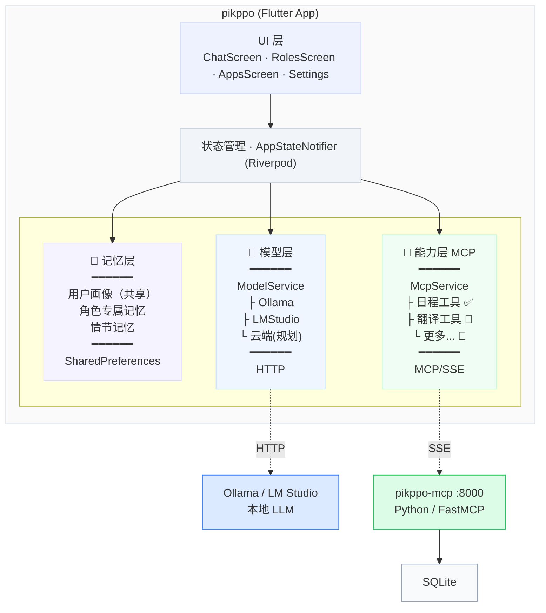

# pikppo 技术方案设计

## 一、背景与目标

### 1.1 背景

pikppo 是一个以对话为核心的私人 AI 助理应用。产品的核心差异化在于：**记忆属于用户而非模型**。用户可以自由切换模型（本地/云端），记忆不丢失；多个角色共建用户画像，同时在各自领域保持专属记忆；外部工具能力通过 MCP 协议接入，与 app 核心解耦。

当前 MVP 已实现基础的多角色对话、本地模型接入、简单记忆管理和本地日程。本技术方案将架构从"单体本地存储"演进到"核心本地 + 工具远程"的混合架构。

### 1.2 设计目标

1. **隐私优先**：用户核心数据（记忆、消息、角色）存储在本地，不出设备
2. **模型无关**：记忆与模型解耦，切换模型零成本
3. **能力可扩展**：工具通过 MCP 协议接入，app 本体不膨胀
4. **离线可用**：MCP 服务不可用时，除工具功能外其他一切正常

### 1.3 设计原则

| 原则 | 说明 |
| --- | --- |
| **数据分治** | 核心数据本地持有，工具数据走 MCP。不混合，不同步 |
| **接口抽象** | ModelService 屏蔽 LLM 差异，McpService 屏蔽工具差异，上层无感知 |
| **渐进增强** | MCP 不可用只影响工具功能，不拖垮整个 app |
| **最小改动** | MCP 集成只改日程相关代码，不动角色/记忆/消息的现有逻辑 |

---

## 二、技术决策

### 2.1 为什么用 SharedPreferences 而非 SQLite 做本地存储

| 维度 | SharedPreferences | SQLite |
| --- | --- | --- |
| 适用场景 | KV 存储，JSON 序列化 | 结构化查询，复杂关联 |
| 当前数据量 | 角色<20、记忆<500、消息<5000，完全够用 | 过重 |
| 迁移成本 | 已全面使用，改 SQLite 需重构所有读写 | — |
| 未来风险 | 数据量超过万级时性能下降 | — |

**决策**：当前阶段继续使用 SharedPreferences。数据量达到瓶颈时迁移到 SQLite 或 Hive，届时只需改存储层，不影响业务逻辑。

**局限性**：不支持复杂查询（如按时间范围检索情节记忆）、不支持并发写入、大数据量时序列化/反序列化性能下降。

### 2.2 为什么用 MCP/SSE 而非 REST API

| 维度 | MCP (SSE) | REST API |
| --- | --- | --- |
| 协议标准 | MCP 是 AI Agent 工具调用的开放标准 | 自定义，无标准 |
| 生态兼容 | AI Agent（Claude/GPT）可直接调用 | 需要额外适配 |
| 工具发现 | 自动发现已注册工具（tools/list） | 需要文档/Swagger |
| 双向通信 | SSE 支持服务端推送 | 仅客户端轮询 |
| 复杂度 | 需要 MCP 客户端库 | HTTP 调用即可 |

**决策**：选择 MCP。核心价值不在传输效率，而在**工具生态兼容**——pikppo-mcp 暴露的工具不仅 app 可以调用，任何 MCP 兼容的 AI Agent 都可以调用。

**局限性**：SSE 是长连接，移动端后台保活有挑战；mcp_client Dart SDK 生态较新（2.0.0），稳定性有待验证；调试比 REST 复杂。

### 2.3 为什么记忆不通过 MCP

| 方案 | 优势 | 劣势 |
| --- | --- | --- |
| 记忆走 MCP | 多设备同步；Agent 可查询 | 隐私数据离开设备；依赖网络；MCP 挂了记忆不可用 |
| **记忆留本地** | 隐私最优；离线可用；响应快 | 不支持多设备同步（当前） |

**决策**：记忆留本地。隐私是产品核心卖点，记忆数据不应依赖外部服务。多设备同步作为 P3 需求，后续通过端到端加密云同步解决，而非 MCP。

### 2.4 群聊路由：LLM 判断 vs 规则匹配

| 方案 | 优势 | 劣势 |
| --- | --- | --- |
| **LLM 路由** | 理解自然语言意图，准确率高 | 每次群聊多一次 LLM 调用，延迟增加 |
| 关键词规则 | 速度快，无额外开销 | 维护成本高，无法理解复杂意图 |

**决策**：使用 LLM 路由。群聊场景对延迟不如私聊敏感（用户预期多个角色回复会慢一些），而准确性直接决定体验。路由 prompt 简短，LLM 调用开销小。

**局限性**：依赖 LLM 可用性；本地小模型可能判断不准；增加一次推理成本。

### 2.5 Riverpod StateNotifier vs 其他状态管理

当前使用单一 AppStateNotifier 管理全部状态。

**优势**：简单直接，所有状态集中管理，UI 通过 `ref.watch` 自动重建。

**局限性**：AppState 已有 13 个字段，AppStateNotifier 超过 700 行，继续膨胀会难以维护。未来应拆分为多个独立 Notifier（ChatNotifier、MemoryNotifier、CalendarNotifier），当前阶段不做，避免过早重构。

---

## 三、系统架构

### 3.1 整体架构



### 3.2 工程结构

| 工程 | 技术 | 职责 |
| --- | --- | --- |
| **pikppo** | Flutter/Dart | 客户端 app：对话、角色、记忆、UI |
| **pikppo-mcp** | Python/FastMCP | MCP 工具服务：日程等可扩展工具 |

### 3.3 数据归属

| 数据 | 存储位置 | 经 MCP | 技术方案 |
| --- | --- | --- | --- |
| 用户画像 | 本地 | ❌ | SharedPreferences，JSON 序列化 |
| 角色定义 | 本地 | ❌ | SharedPreferences，JSON 序列化 |
| 角色专属记忆 | 本地 | ❌ | SharedPreferences，按 roleId 分组 |
| 情节记忆 | 本地 | ❌ | SharedPreferences，按 roleId 分组 |
| 聊天消息 | 本地 | ❌ | SharedPreferences，JSON 序列化 |
| 群组 | 本地 | ❌ | SharedPreferences，JSON 序列化 |
| 用户设置 | 本地 | ❌ | SharedPreferences，KV 存储 |
| 日程事件 | pikppo-mcp | ✅ | MCP 工具调用，服务端 SQLite |

---

## 四、技术栈

### 4.1 客户端 (pikppo)

| 模块 | 技术 | 版本 |
| --- | --- | --- |
| 框架 | Flutter / Dart | SDK ^3.11 |
| 状态管理 | flutter_riverpod | ^2.6.1 |
| 本地存储 | shared_preferences | ^2.5.3 |
| HTTP | dio | ^5.8.0 |
| MCP 客户端 | mcp_client | ^2.0.0 |
| 路由 | go_router | ^15.1.2 |
| UI | Material 3 | Flutter 内置 |
| ID 生成 | uuid | ^4.5.1 |

### 4.2 MCP 服务 (pikppo-mcp)

| 模块 | 技术 |
| --- | --- |
| 框架 | FastMCP (Python mcp SDK) |
| 传输协议 | SSE (Server-Sent Events) |
| 数据库 | SQLite (aiosqlite) |
| 默认端口 | 8000 |

---

## 五、数据模型

### 5.1 Role（角色）

```dart
class Role {
  final String id;           // UUID
  final String name;         // 角色名称
  final String icon;         // emoji
  final String description;  // 一句话描述
  final String color;        // hex，如 '#3B82F6'
  final String systemPrompt; // 角色 system prompt
}
```

### 5.2 Message（消息）

```dart
class Message {
  final String id;           // UUID
  final String roleId;       // 所属角色
  final String content;      // 消息内容
  final bool isUser;         // true=用户，false=AI
  final int timestamp;       // 毫秒时间戳
  final String? groupId;     // null=私聊，non-null=群聊
}
```

### 5.3 Memory（记忆）

```dart
class Memory {
  final String id;           // UUID
  final String type;         // semantic | episodic | working
  final String content;      // 记忆内容
  final String? roleId;      // null=用户画像(共享)，non-null=角色专属
  final int timestamp;       // 毫秒时间戳
  final List<String> tags;   // 分类标签
}
```

**归属规则**：
- `roleId == null`：用户画像，全角色共享
- `roleId != null`：角色专属记忆 + 情节记忆，仅该角色对话时加载

**加载策略**：`用户画像(roleId==null) + 当前角色专属(roleId==currentRoleId)`

### 5.4 Group（群组）

```dart
class Group {
  final String id;
  final String name;
  final List<String> roleIds;
}
```

### 5.5 CalendarEvent（日程事件）

```dart
class CalendarEvent {
  final String id;
  final String title;
  final DateTime date;
  final String? time;            // HH:mm
  final String? endTime;
  final String? description;
  final int? reminderMinutes;
}
```

存储在 pikppo-mcp 服务端。`toJson()` 输出 snake_case，`fromJson()` 兼容两种风格，可直接用于 MCP 数据交换。

### 5.6 AppState（全局状态）

```dart
class AppState {
  final List<Role> roles;
  final List<Message> messages;
  final List<Memory> memories;
  final List<Group> groups;
  final List<CalendarEvent> calendarEvents;  // MCP 缓存
  final String currentRoleId;
  final String currentModel;
  final String serviceType;        // ollama | lmstudio
  final String serviceHost;        // LLM 服务地址
  final String mcpHost;            // MCP 服务地址
  final String userName;
  final String preferredLanguage;
  final bool isLoading;
  final String? loadingGroupId;
}
```

---

## 六、核心模块设计

### 6.1 模型层 (ModelService)

统一接口屏蔽 LLM 服务差异：

```dart
abstract class ModelService {
  Future<List<String>> fetchModels();
  Future<String> chat(List<Map<String, String>> messages, String model);
}

class OllamaService implements ModelService { ... }
class LMStudioService implements ModelService { ... }
// 未来: class CloudModelService implements ModelService { ... }
```

| 服务 | 模型列表 | 对话接口 |
| --- | --- | --- |
| Ollama | `GET /api/tags` | `POST /api/chat` |
| LM Studio | `GET /v1/models` | `POST /v1/chat/completions` (OpenAI 兼容) |

### 6.2 MCP 层 (McpService)

```dart
enum McpConnectionState { disconnected, connecting, connected, error }

class McpService {
  McpConnectionState get state;

  Future<void> connect(String serverUrl);  // SSE transport
  Future<void> disconnect();

  /// 通用工具调用（供扩展）
  Future<String?> callTool(String name, [Map<String, dynamic> args]);

  // 日程工具 (typed 封装)
  Future<List<CalendarEvent>> listEvents({String? startDate, String? endDate});
  Future<CalendarEvent?> getEvent(String eventId);
  Future<CalendarEvent> createEvent(CalendarEvent event);
  Future<CalendarEvent> updateEvent(CalendarEvent event);
  Future<void> deleteEvent(String eventId);
}
```

**MCP 工具映射**：

| 方法 | MCP 工具 | 参数 |
| --- | --- | --- |
| `listEvents` | `list_calendar_events` | `{start_date, end_date}` |
| `getEvent` | `get_calendar_event` | `{event_id}` |
| `createEvent` | `create_calendar_event` | `{title, date, time?, ...}` |
| `updateEvent` | `update_calendar_event` | `{event_id, title?, ...}` |
| `deleteEvent` | `delete_calendar_event` | `{event_id}` |

**扩展新工具**：McpService 添加 typed 方法封装 `callTool`，无需改动连接层。

### 6.3 记忆层

**对话时加载**：

```dart
List<Memory> getMemoriesForChat(String roleId) {
  return memories.where((m) =>
    m.roleId == null ||       // 用户画像（共享）
    m.roleId == roleId        // 当前角色专属
  ).toList();
}
```

**后台归纳流程**（定期 + 闲时触发）：

1. 收集近期对话记录，按角色分组
2. 调用 LLM 提取事实（Prompt 指定分类：性格/偏好/健康/职业/家庭...）
3. 归属判断：基础特征 → 用户画像 `(roleId=null)`，领域细节 → 角色专属 `(roleId=角色ID)`
4. 冲突检测：新旧矛盾时更新旧记忆
5. 情节记忆：关键事件 → `Memory(roleId=角色ID, type='episodic')`
6. 持久化到 SharedPreferences

### 6.4 对话上下文构建

```dart
final system = '''${role.systemPrompt}

关于用户：
${profileMemories.map((m) => m.content).join('、')}

${role.name}的专属记忆：
${roleMemories.map((m) => m.content).join('、')}

近期事件：
${episodic.map((m) => m.content).join('；')}

$calendarContext''';

messages = [system, ...最近10条历史, userInput];
```

### 6.5 群聊路由

无 @mention 时，LLM 判断消息与哪些角色相关：

```dart
Future<List<String>> routeMessage(String content, Group group) async {
  final prompt = '''判断以下消息与哪些角色相关，返回角色 id 的 JSON 数组。
可用角色：
${角色描述列表}
消息：$content''';

  final result = await modelService.chat([...], model);
  final roleIds = jsonDecode(result) as List;
  return roleIds.isEmpty ? [group.roleIds.first] : roleIds.cast<String>();
}
```

---

## 七、项目结构

### 7.1 pikppo (Flutter)

```
lib/
├── main.dart                        # 入口，初始化 McpService
├── models/
│   ├── app_state.dart               # 全局状态（含 mcpHost）
│   ├── role.dart
│   ├── message.dart
│   ├── memory.dart                  # roleId 区分画像/专属
│   ├── group.dart
│   └── calendar_event.dart
├── providers/
│   ├── app_state_provider.dart      # 核心状态管理
│   └── model_service_provider.dart
├── services/
│   ├── model_service.dart           # LLM 抽象接口
│   ├── ollama_service.dart
│   ├── lmstudio_service.dart
│   └── mcp_service.dart             # MCP 客户端封装
├── screens/
│   ├── chat_list_screen.dart
│   ├── chat_detail_screen.dart
│   ├── group_chat_screen.dart
│   ├── roles_screen.dart
│   ├── memory_screen.dart
│   ├── apps_screen.dart             # 纯 MCP 工具入口
│   └── settings_screen.dart         # 含 MCP 配置 + 记忆管理
├── widgets/ ...
└── data/
    └── mock_data.dart
```

### 7.2 pikppo-mcp (Python)

```
src/app/
├── __main__.py                      # 入口 (python -m app --transport sse)
├── server.py                        # FastMCP 服务初始化
├── database.py                      # SQLite 连接与建表
├── models/ ...                      # Pydantic 模型
├── services/ ...                    # 业务逻辑
└── tools/                           # 20 个 MCP 工具
    ├── calendar.py                  # 5 个日程工具（app 当前使用）
    ├── roles.py                     # 4 个（供 Agent 调用）
    ├── memories.py                  # 5 个（供 Agent 调用）
    ├── groups.py                    # 4 个（供 Agent 调用）
    └── users.py                     # 2 个（供 Agent 调用）
```

---

## 八、接口规格

### 8.1 MCP 工具接口（日程）

pikppo-mcp 通过 SSE transport，端口 8000。

| 工具 | 参数 | 返回 |
| --- | --- | --- |
| `list_calendar_events` | `{start_date?, end_date?}` | `CalendarEvent[]` JSON |
| `get_calendar_event` | `{event_id}` | `CalendarEvent` JSON |
| `create_calendar_event` | `{title, date, time?, end_time?, description?, reminder_minutes?}` | 创建的 JSON |
| `update_calendar_event` | `{event_id, title?, date?, ...}` | 更新后 JSON |
| `delete_calendar_event` | `{event_id}` | `"已删除"` |

### 8.2 LLM 接口

| 服务 | 模型列表 | 对话 |
| --- | --- | --- |
| Ollama | `GET {host}/api/tags` | `POST {host}/api/chat` → `response.message.content` |
| LM Studio | `GET {host}/v1/models` | `POST {host}/v1/chat/completions` → `choices[0].message.content` |

---

## 九、错误处理

| 场景 | 处理 |
| --- | --- |
| LLM 连接失败 | SnackBar「无法连接到本地模型服务」 |
| LLM 超时（30s） | AI 气泡「请求超时，请重试」 |
| MCP 服务未启动 | 日程不可用，其他正常 |
| MCP 操作失败 | 报错，不本地兜底（避免数据分裂） |
| 群聊路由异常 | 兜底由第一个角色回复 |
| 记忆归纳失败 | 跳过本次，下次重试 |

---

## 十、已知局限与演进方向

### 当前局限

| 局限 | 影响 | 应对 |
| --- | --- | --- |
| SharedPreferences 不适合大数据量 | 万级消息后序列化变慢 | 未来迁移 SQLite/Hive |
| 单一 AppStateNotifier 过重 | 代码维护性下降 | 未来拆分为领域 Notifier |
| 记忆归纳依赖 LLM 质量 | 本地小模型可能提取不准 | 可配置归纳用的模型（如用更强的云端模型做归纳） |
| MCP SSE 移动端保活 | app 进后台可能断连 | 重启时自动重连 + 定期心跳 |
| 群聊路由额外推理开销 | 群聊响应比私聊慢一轮 | 路由 prompt 精简，控制在 100 token 以内 |
| 记忆无云端同步 | 换设备丢记忆 | P3 端到端加密同步 |

### 演进方向

| 阶段 | 技术方向 |
| --- | --- |
| **近期** | MCP 日程集成 + 群聊路由 + 记忆分层 + 自动归纳 |
| **中期** | 云端模型接入 + 更多 MCP 工具 + 存储层升级 |
| **远期** | 记忆云端同步 + 向量检索 + IM 接入 |

---

## 十一、当前实现与待办

### 已实现

| 模块 | 状态 |
| --- | --- |
| 多角色私聊 | ✅ |
| 多角色群聊（所有角色依次回复） | ✅ |
| 自定义角色创建（AI 生成 Prompt） | ✅ |
| 记忆系统（三层，手动增删） | ✅ |
| Ollama / LM Studio 对接 | ✅ |
| 日程管理（本地 SQLite） | ✅（待迁移 MCP） |
| AI 日程提取 + 提醒解析 | ✅ |
| 定时提醒（30s 轮询） | ✅ |
| pikppo-mcp 服务（20 个工具） | ✅ |

### 待实现

| 模块 | 优先级 | 说明 |
| --- | --- | --- |
| 日程迁移到 MCP | P0 | McpService 替换 CalendarApiService |
| 群聊路由模型 | P0 | LLM 智能判断替换全员依次回复 |
| 记忆分层 | P1 | Memory.roleId 区分画像/专属 |
| 记忆自动归纳 | P1 | 定期 + 闲时，后台 LLM 提取 |
| 冷启动引导 | P1 | 首次打开建立基础画像 |
| 设置页 MCP 配置 | P1 | 地址、连接状态 |
| 云端模型接入 | P2 | CloudModelService |
| 更多 MCP 工具 | P2 | 翻译、邮件、待办 |
| 记忆云端同步 | P3 | 端到端加密 |
